<div align="center">

# 🗂️ Sistema de Gestión de Permisos del Personal

### Aplicación de consola desarrollada en Python puro — sin frameworks ni librerías externas

[](https://python.org)
[](https://es.wikipedia.org/wiki/Programaci%C3%B3n_orientada_a_objetos)
[](https://www.json.org/)
[](#)

</div>

---

## 👥 Autores

| Nombre |
|--------|
| Jhoan Ariel Cevallos Villavicencio |
| Jean Pierre Jiménez Bajaña |
| José Antonio Torres Torres |
| Jhonatan Gabriel Castro Belfor |
| Elian Wladimir Galeas Barén |

| Campo | Detalle |
|-------|---------|
| 📚 **Materia** | Programación Orientada a Objetos |
| 👨‍🏫 **Docente** | Ing. Daniel Vera |
| 📅 **Fecha** | 2026 |

---

## 📋 Descripción

Sistema de gestión que permite administrar empleados, tipos de permisos y solicitudes de permisos laborales. Incluye cálculo automático de descuentos según el tipo de permiso y persistencia de datos en archivos JSON.

---

## ⚙️ Requisitos

- **Python 3.10 o superior**
- No requiere instalar librerías externas
- Compatible con **Windows**, **Mac** y **Linux**

---

## 🚀 Cómo ejecutar

```bash
# Clonar el repositorio
git clone https://github.com/iJack100/Sistema_Permisos.git

# Entrar a la carpeta del proyecto
cd Sistema-de-Gestion-de-Permisos-del-Personal/PRACT_PERMISOS

# Ejecutar el programa
python main.py
```

---

## 🗂️ Estructura del proyecto

```
PRACT_PERMISOS/
│
├── main.py                        # Punto de entrada del programa
│
├── core/                          # Núcleo del sistema
│   ├── interfaces.py              # Clase abstracta ICrud (contrato CRUD)
│   ├── mixins.py                  # CalculosMixin (validaciones y cálculos)
│   ├── decoradores.py             # Color, Pantalla, decorador_interfaz, manejar_errores, validar_cedula
│   └── json_manager.py            # Lectura y escritura de archivos JSON
│
├── models/                        # Entidades del dominio
│   ├── empleado.py                # Clase Empleado
│   ├── tipo_permiso.py            # Clase TipoPermiso
│   └── permiso.py                 # Clase Permiso
│
├── controllers/                   # Lógica CRUD por entidad
│   ├── empleado_controller.py     # CRUD de empleados + validación de cédula
│   ├── tipo_permiso_controller.py # CRUD de tipos de permiso
│   ├── permiso_controller.py      # CRUD de permisos + estadísticas con HOF
│   └── stats_controller.py        # Estadísticas generales del sistema
│
├── views/                         # Interfaz de usuario en consola
│   └── menu_principal.py          # Menú principal de navegación
│
├── data/                          # Persistencia en archivos JSON
│   ├── empleados.json
│   ├── tipos_permisos.json
│   └── permisos.json
│
└── docs/
    ├── diagrama_de_clases.excalidraw
    ├── diagrama_de_procesos.excalidraw
    └── img/                       # Capturas de pantalla del sistema
```

---

## ✅ Funcionalidades

- ✅ CRUD completo de Empleados
- ✅ CRUD completo de Tipos de Permiso
- ✅ CRUD completo de Permisos
- ✅ Validación de cédula ecuatoriana (algoritmo Módulo 10)
- ✅ Cálculo automático de valor hora y descuentos
- ✅ Estadísticas de permisos (remunerados, no remunerados, totales)
- ✅ Eliminación en cascada de permisos al eliminar empleado o tipo
- ✅ Persistencia automática en archivos JSON
- ✅ Interfaz de consola con colores ANSI
- ✅ Manejo de errores sin cortar la ejecución del programa

---

## 🖥️ Vista previa
### Menú principal
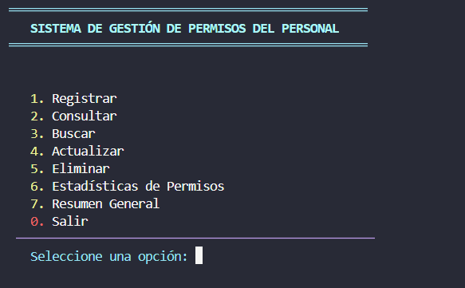
### Menús del sistema
| Registrar | Consultar |
|-----------|-----------|
| 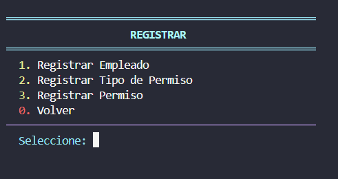 | 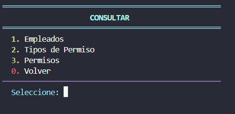 |
| Buscar | Eliminar | Actualizar |
|--------|----------|------------|
| 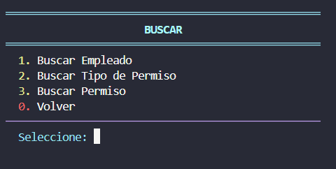 | 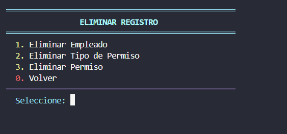 | 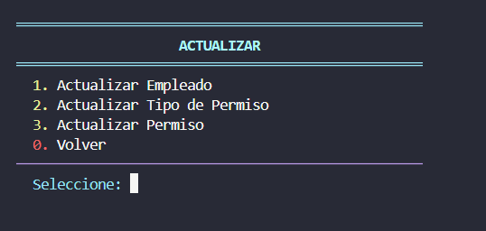 |
---
### 👤 Empleados
| Registro | Consultar | Buscar |
|----------|-----------|--------|
| 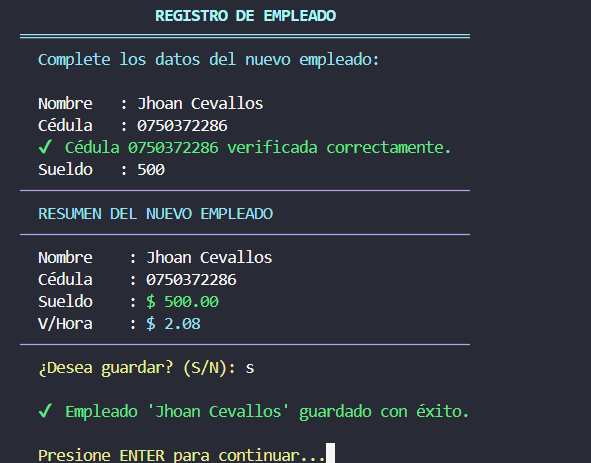 | 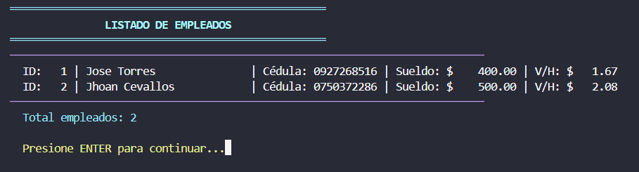 | 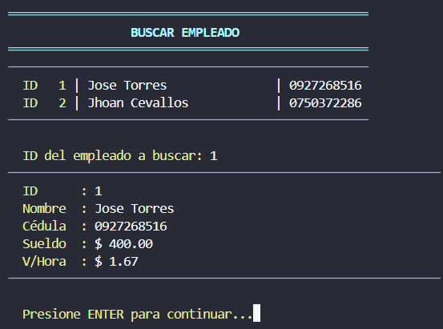 |
| Eliminar | Actualizar |
|----------|------------|
| 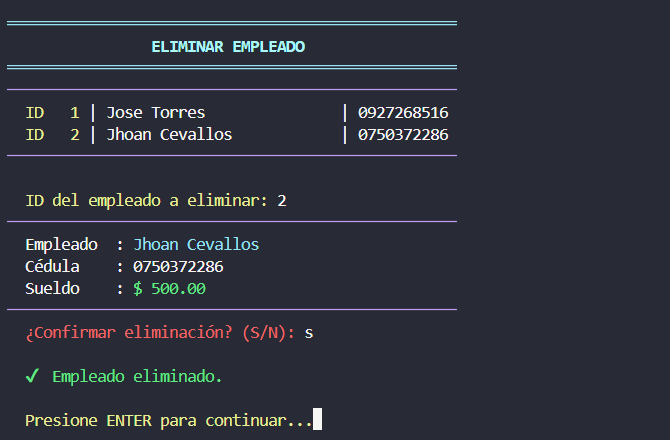 | 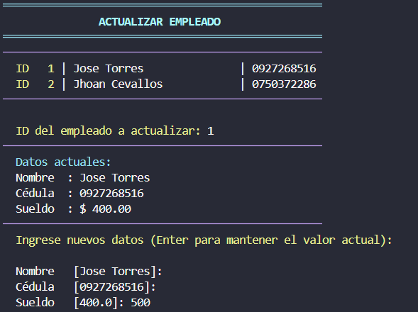 |
---
### 🏷️ Tipos de permiso
| Registro | Consultar | Buscar | Actualizar |
|----------|-----------|--------|------------|
| 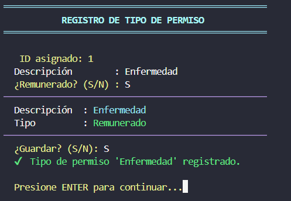 | 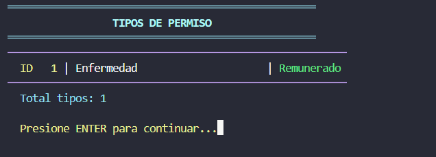 | 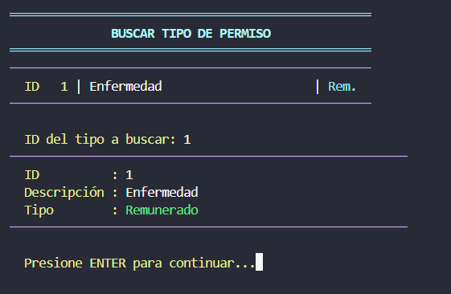 | 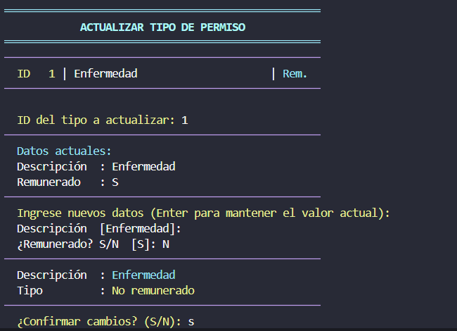 |
---
### 📄 Permisos
| Registro | Consultar | Buscar | Actualizar |
|----------|-----------|--------|------------|
| 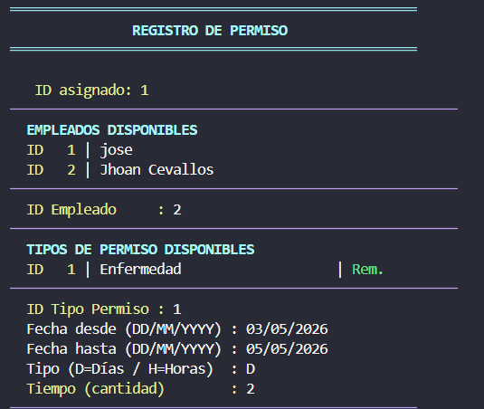 | 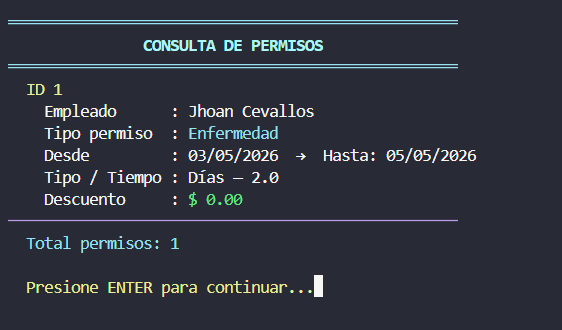 | 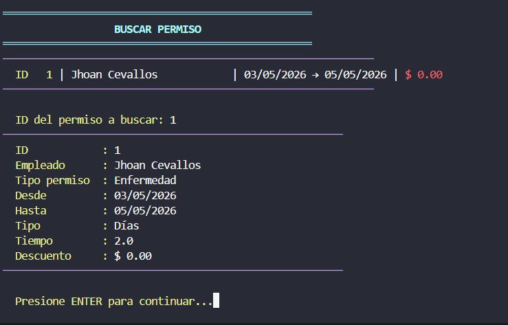 | 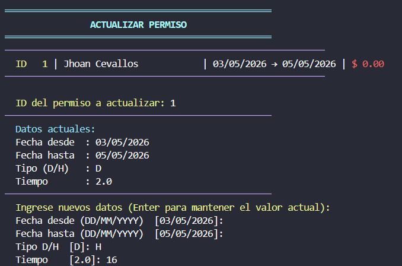 |
---
### 📊 Estadísticas y resumen
| Estadísticas de permisos | Resumen general |
|--------------------------|-----------------|
| 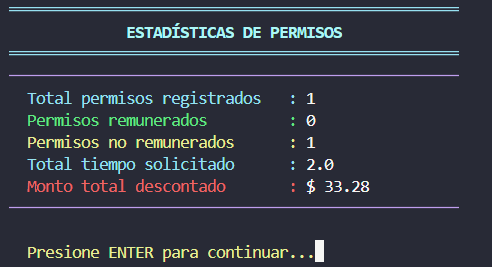 | 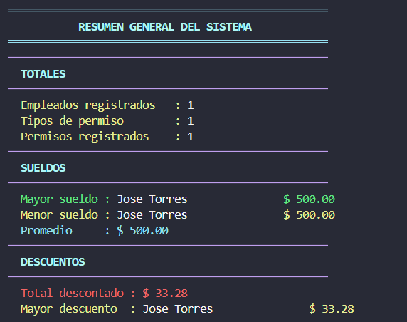 |
---
### 👋 Despedida
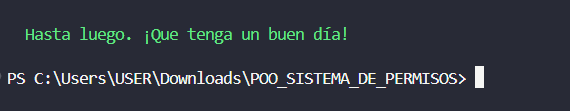
---

## 🧠 Conceptos POO aplicados

| Concepto | Descripción | Archivo(s) |
|----------|-------------|------------|
| **Clases abstractas** | `ICrud` define el contrato CRUD obligatorio | `core/interfaces.py` |
| **Mixins** | `CalculosMixin` comparte validaciones entre controllers | `core/mixins.py` |
| **Decoradores** | Manejan errores, validan cédula y muestran encabezados | `core/decoradores.py` |
| **Herencia múltiple** | Todos los controllers heredan `ICrud` y `CalculosMixin` | `controllers/` |
| **HOF** | `map`, `filter`, `reduce` para estadísticas | `controllers/permiso_controller.py` |
| **Persistencia JSON** | Serialización con `to_dict` y `from_dict` | `core/json_manager.py` |
| **Expresiones regulares** | Validación de fechas y nombres | `core/mixins.py` |

---

## 📐 Reglas de negocio

### Cálculo de valor hora
```
valor_hora = sueldo / 240
```
> 240 = 8 horas × 30 días laborables al mes

### Cálculo de descuento por permiso

| Tipo permiso | Modalidad | Fórmula |
|--------------|-----------|---------|
| Remunerado (`S`) | Días o Horas | `$0.00` _(sin descuento)_ |
| No remunerado (`N`) | Días (`D`) | `tiempo × 8 × valor_hora` |
| No remunerado (`N`) | Horas (`H`) | `tiempo × valor_hora` |

### Eliminación en cascada
- Al eliminar un **empleado** → se eliminan todos sus permisos
- Al eliminar un **tipo de permiso** → se eliminan todos los permisos de ese tipo

### Validación de cédula ecuatoriana
1. Debe tener exactamente **10 dígitos numéricos**
2. Los 2 primeros dígitos representan la **provincia** (01–24)
3. El dígito final es verificado con el **algoritmo Módulo 10**

---

## 💡 Decisiones de diseño

- **JSON** en lugar de base de datos → mantiene el proyecto sin dependencias externas y facilita la revisión de datos.
- **Decoradores** para manejo de errores y encabezados → mantiene los controllers limpios y enfocados en la lógica de negocio.
- **Patrón Mixin** → evita duplicar validaciones siguiendo el principio DRY _(Don't Repeat Yourself)_.
- **Separación de responsabilidades** → models almacenan datos, controllers manejan lógica, views manejan la interfaz.
- **Inyección de dependencias** → los controllers reciben otros controllers como parámetros en lugar de crearlos internamente, evitando dependencias circulares.

---


<div align="center">

Desarrollado como proyecto académico — Programación Orientada a Objetos · 2026

</div>
